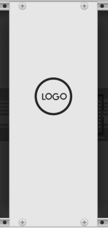

# Generic Blank

[Repo](https://github.com/Paul-Dempsey/GenericBlank)

Generic Blank is a template for a VCV Rack blank panel plugin. This is a plugin that contains only a blank panel module. It looks like this:



If you want something more than just a blank plugin, then you're probably better off following the Rack plugin guide or by cloning an existing module.

> **IMPORTANT**
>
> This template is provided AS-IS, without support, etc. Terms are in the [LICENSE](LICENSE) file. I built and ran this on Windows 11 and Rack 2.3. If there are issues, you can open an issue in this repo. You are responsible for any plugin you make based on this template. If you need more help with building and coding a Rack plugin, [VCV Community - Development ](https://community.vcvrack.com/c/development) is a friendly place to go.

Before you can build this plugin, you must set up a Rack development environment following the guide at [VCV Rack Plugin Development](https://vcvrack.com/manual/PluginDevelopmentTutorial).

You can make new repo for yourself using this repo as a template, or you can copy all the files to a folder in the Rack development plugins folder.

To make it your own:

1. Edit plugin.json to fill in the particulars of your plugin slug and name, module slug and name, your brand and company info, the kind of license you want to use, and so on. See [Plugin Manifest](https://vcvrack.com/manual/Manifest) for the VCV Rack requirements. These details MUST be different than what appears in this repo.

2. If you change the plugin slug in `plugin.json`, you must change this line in `src/Blank.cpp` to match:

   ```cpp
   Model *modelBlank = createModel<BlankModule, BlankModuleWidget>("blank");
   ```

   Now you're ready to build your plugin, run rack and see if it's working. If all is well, you can take the final step.

3. Edit `res/Blank.svg` to give your blank module it's unique appearance. It's worthwhile reviewing the VCV Rack [Panel Guide](https://vcvrack.com/manual/Panel) for guidance on the design of the panel.

If you want to publish your module to the library, see the information at the end of the [ Plugin Tutorial](https://vcvrack.com/manual/PluginDevelopmentTutorial).

I hope this was useful to you.

:- Paul (aka pachde)